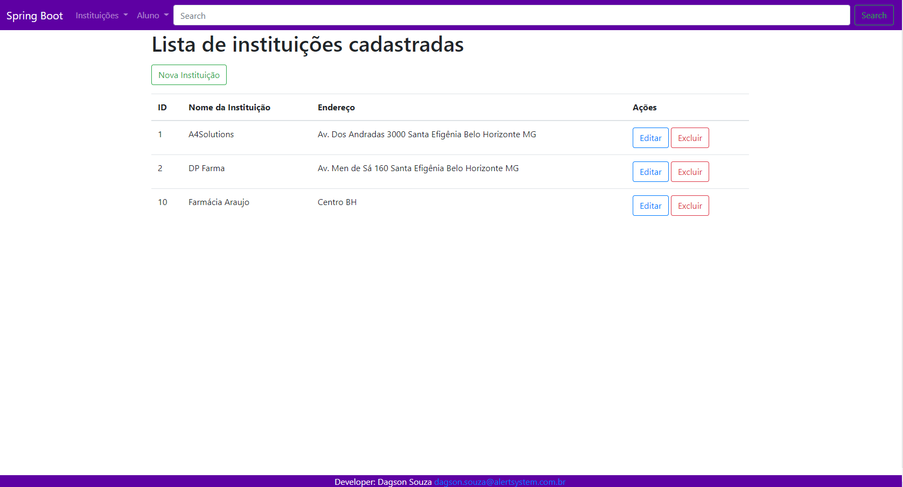

# Projeto Spring Boot e Thymeleaf

> CRUD 1-N Utilizando, Spring Boot, Spring Data, JPA, SpringMVC, Hibernate, Bootstrap, JQuery e MySQL 8
  
  

> Link de Acesso: https://a4s-spring-boot.herokuapp.com/home/
